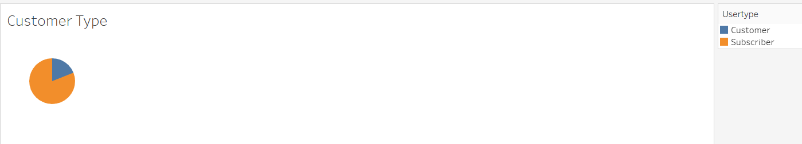
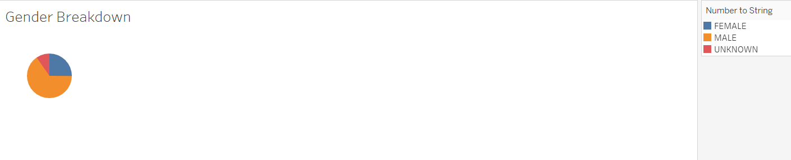
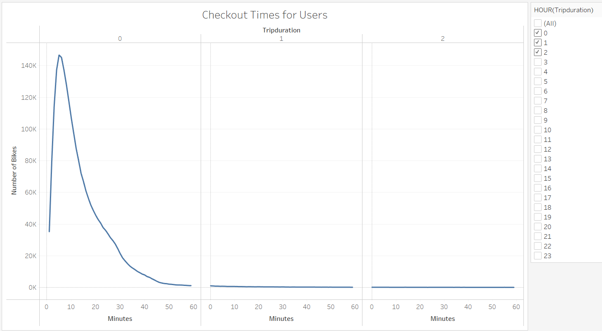
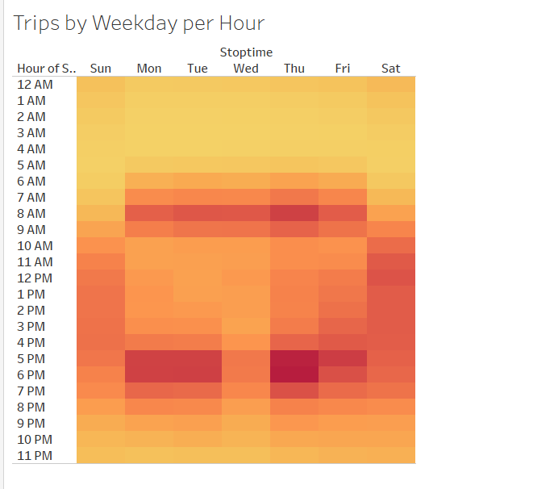
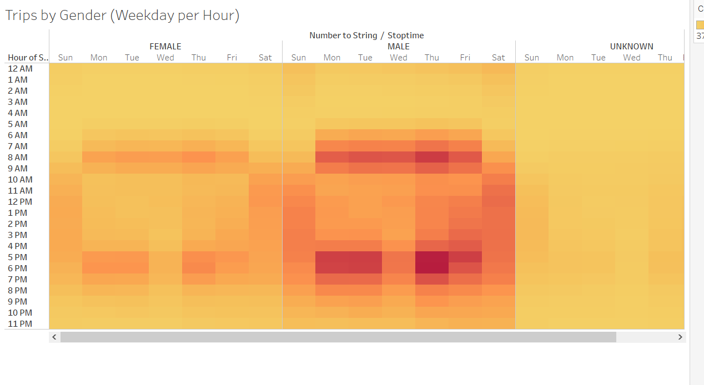
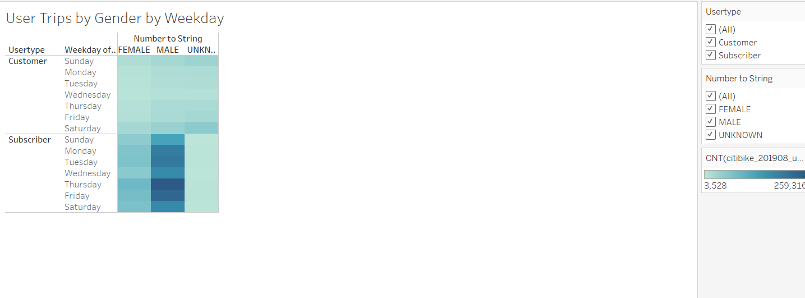

# NY Citibike with Tableau

## Overview of the statistical analysis

- The purpose of this project is to  convince investors that a bike-sharing program in Des Moines is a solid business proposal by showing the stakeholders a bike trip analysis. 

## Results

- Five different graphs were made to present the data, as seen in the Tableau story.
- [link to dashboard](https://public.tableau.com/profile/jessie.ju#!/vizhome/VisualizationfortheTripAnalysis/Story1 "link to dashboard")
- 
- This pie chart shows the distribution of populations of each type of customers. There are more subscribers than there are customers.
- 
- This pie chart shows the gender breakdown in the population. There are more male customers than female or unknown ones.
- 
- This line graph shows the length of time that bikes are checked out for all riders. Most people check out their bikes for around 10 minutes.
- 
- This line graph shows the length of time that bikes are checked out for each gender. The peak checkout time for every gender is identical (around 10 minutes).
- 
- This heatmap shows the number of bike trips by weekday for each hour of the day. On weekdays, most people check out bikes around 6AM-9AM, and again around 4PM-7PM, shows that most people use their bikes to commute to work or school. On weekends, most people check out their bikes between 9AM to 7PM.
- 
- This heatmap shows the number of bike trips by gender for each hour of each day of the week. While the overall pattern is identical, there are way more males who check out bikes than females around any given time.
- 
- This heatmap shows the number of bike trips by gender for each hour for each day of the week. In general, subscribers check out bikes way moe often than regular customers, especially male subscribers.

## Summary

- In summary, subscribers use the service more often, which shows that the subscription system works.
- This industry is going to be very male-oriented as males are clearly the target customers.
- Most people use the service during commute times on the weekdays, so there should be more bikes provided for those times. 
- An additional graph I would make would be a visualisation of where the bikes are being checked out. Making a map of the city and making pin points would help with the visualisation. This will help the business see which areas are most in need of bikes.
- Another addition graph I would make is a comparison of users of different age groups. While we have the data on genders, figuring out which age groups use the service the most frequently will help the business further clarify their target customers.
